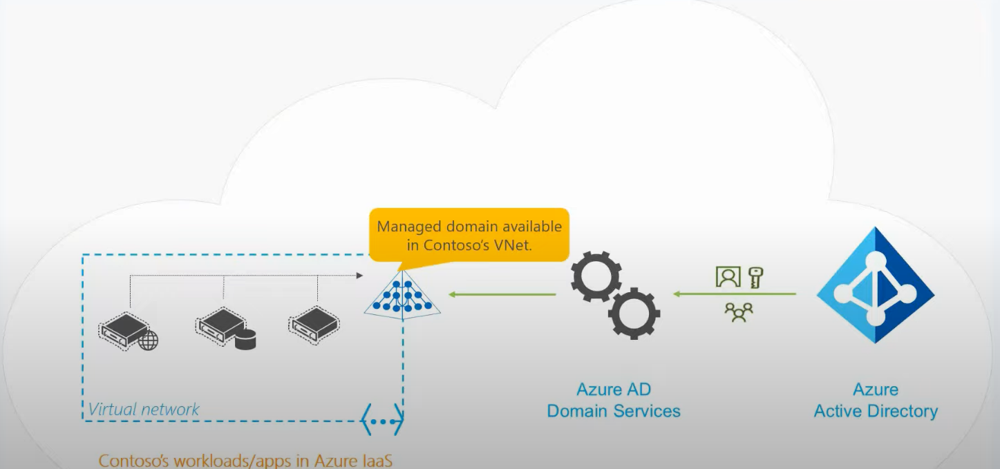

# Azure AD Domain Services
🔖 Diferenças AAD X AADDS X ADDS

👉 Azure Active Directory (AAD)
* O Microsoft Azure Acitive Directory é uma solução de nuvem de gerenciamento de acesso e identidade abrangente que combina os
principais serviços de diretório, gerencimaneto do acesso de aplicativos e proteção de identidade avançada.
* Sincroniza usuários e grupos do ADDS utilisando o Azure AD Connect

👉 Azure Active Directory Domain Services (AADDS)
* O Azure Active Directory Domain Services é um serviço autônomo no Azure que habilita um serviço de diretório, sem necessidade de
  configurar um servidor controlador de domínio. Ele cria um controlador de domínio como um serviço, você não precisa se preocupar 
  com tempo de inatividade, patching ou outras coisas
* Sincroniza usuários e grupos automaticamente do AAD.

👉 Active Directory Domain Services (On-premises)
* O Active Directory Domain Services (ADDS) é o principal serviço de diretórios da Microsoft e base para as novas tecnologias de cloud.
  O ADDS usa um armazenamento de dados estruturado como base para uma organização lógica e hierárquica de informações de diretório.
* Pode sincronizar seus usuários e grupos com AAD utilizando o Azure AD Connect

🔖 O que é o Azure ADDS?

* O AAD DS (Azure Active directory Domain Services) fornece serviços de domínio gerenciado, como ingresso no domínio, política de grupo,
  protocolo LDAP e autenticação Kerberos/NTLM

* Você pode usar esses serviços de domínio sem a necessidade de implantar, gerenciar e aplicar um patch em DCs na nuvem

* O Azure AD DS integra-se com seu tenant existente do Azure AD. Essa integração permite que usuários entrem em serviços e aplicativos
  conectados ao domínio gerenciado usando as respectivas credenciais existentes.
  
👉 Características
  * Experiência de implantação simplificada
  * Integrado ao Azure AD
  * Senhas/credenciais corporativas
  * Autenticação Kerberos e NTLM
  * Alta disponibilidade
  * Possivel adicionar máquinas ao domínio
  * Suporte utilização de GPOs

🔖 Cenários Azure ADDS

Azure ADDS + Azure AD (ambiente 100% cloud)



Azure ADDS + Azure AD + Active Directory DS(ambiente hibrido)


# Dúvidas e pontos de atenção do AADDS

```  
* Usuário deve ser criado no Azure AD para ser replicado para o AADDS
* Usuários replicados não podem ser movidos das OUs defaults
* O AADDS não é uma extensõ do ADDS (AD LOCAL)
* TODOS os usuários sincronizados do Azure AD para o AADDS precisam resetar suas senhas
* A politica de troca de senhas do Azure AD e AADDS não é unificada
* O nome do domínio do AADDS deve ser um domínio roteável e diferente do seu domínio local
* Não é possível extender o schema do AADDS
* Não é possível criar atributos customizados no AADDS
* Não é possível pausar o serviço do AADDS
* Não suporte a integração com usuários guest do Azure AD 

``` 

🔖 Demonstração prática [aqui](https://github.com/rafamellonh/Azure-AD-Domain-Services/blob/main/lab.md)