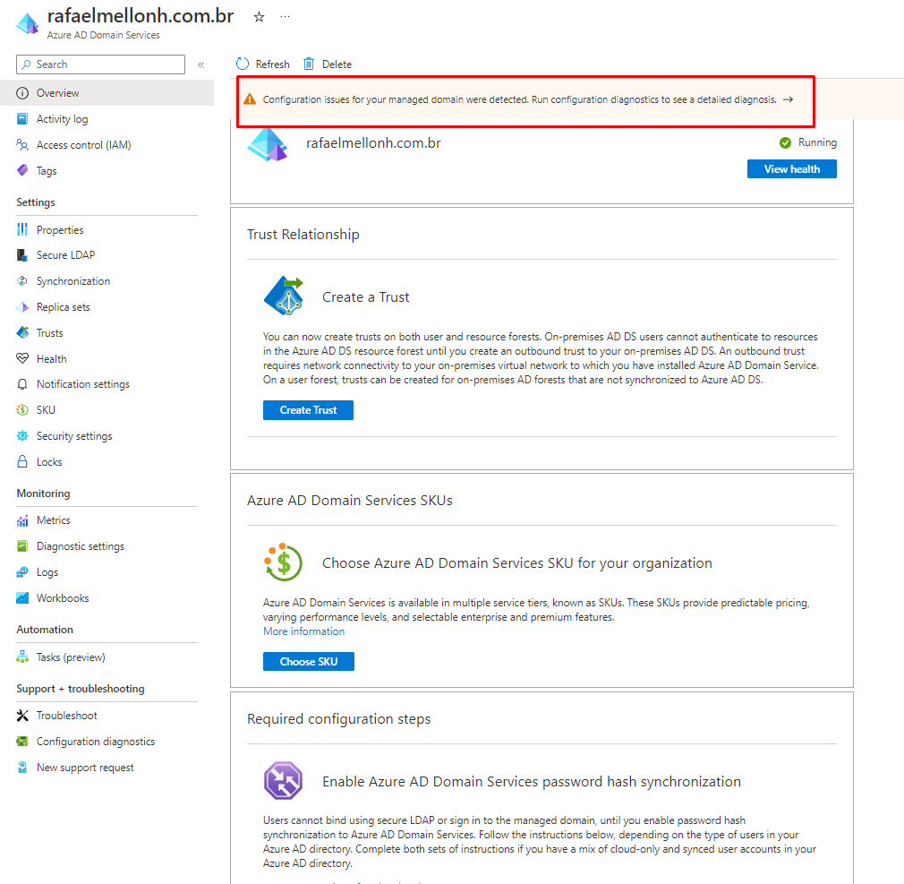

# Azure AD Domain Services
👉 

🔖 Alguns requisítos
* Máquina virtual para gerenciar o serviço ou uma máquina que acesse a rede do Azure para gereciamento
* Uma virtual network com uma Subnet específica para o serviço
* Configuração de DNS
* As VNETs precisam levar os endereços de IPs do Active directory Domins Servers para que todas as vms
  consigam chegar até o domínio.

👉 Virtual Network

👉 Virtual Machine
* Crie uma VM simples para realizar o gerenciamento do AADDS

👉 AADDS
 * Esse processo pode demorar até duas horas.
  

* Clique aqui para fazer a correção nos registros de DNS na VNET

* Valide a configuração na VNET

👉 Conforme dito, é preciso alterar as senhas dos usuários
* Altere a senha do usuário que foi cadastrado para administrar o AADDS

👉 Insira a VM no domínio com esse usuário ou qualquer usuário dentro do grupo abaixo:

